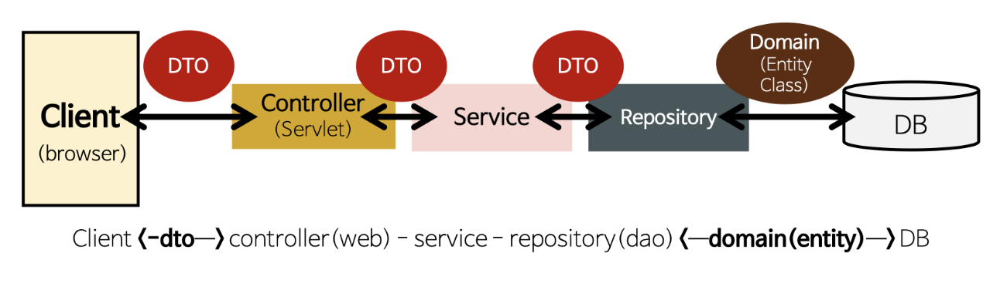

###DAO
Data Access Object  
DB에 접근하기 위해 사용한다.  

###VO

###DTO
Data Transfer Object  
데이터 교환 시 사용하며, 게터와 세터만 가진다.  

###Domain(Entity)

###Repository

DAO Repository 차이: https://velog.io/@maketheworldwise/DAO%EC%99%80-Repository%EC%9D%98-%EC%B0%A8%EC%9D%B4  
DAO, DTO, Entity ... 차이: https://velog.io/@haron/Spring-DAO-DTO-Entity-Class%EC%9D%98-%EC%B0%A8%EC%9D%B4 ,   
https://jihoon2723.tistory.com/entry/VO-DAODTO-Entity-Domain-%ED%81%B4%EB%9E%98%EC%8A%A4-%EB%B9%84%EA%B5%90%ED%95%98%EA%B8%B0  
https://dkswnkk.tistory.com/500  

